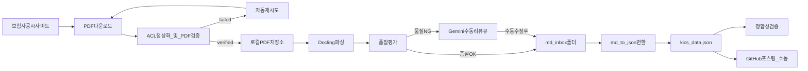

# KICS 파이프라인 개요

## 목적

`kics_data.json`이 만들어지기까지의 전 과정을 일관된 용어로 정의하고, 신규 운영 경로(Docling 메인)와 레거시/보조 경로를 분리해 관리합니다.

## 산출물 명칭 매핑

- `kics_data.json`: 단일 표준 산출물(본 문서 및 코드의 기준)
- `insurance_data.json`: deprecated alias. 환경변수 `SOLVENCY_LEGACY_JSON_ALIAS`가 비어있지 않을 때만 함께 기록됨
- `kics_disclosure.csv`: 레거시 CSV 원천(보존)

## 전체 흐름



## 모듈 책임 분리(현재 코드 기준)

### 1) 다운로드 계층

- 단일 엔진: `src/solvency/downloader/base.py` + `runner.py`
- 협회 단위 핸들러:
  - `handlers/nonlife_insurance_association.py` (KNIA 손보협회, 16개 일괄)
  - `handlers/life_insurance_association.py` (생명보험협회)
- 회사명 → 사코드 매핑은 `*_insurer_registry.yaml`로 분리
- 다운로드 직후 ACL 정상화 + `verify_pdf` 자동 호출, 실패 시 자동 재시도
- 레거시 4종(`legacy/downloaders/*.py`)은 회귀 시 fallback 용도로 보존

### 2) PDF 검증 계층 (신규)

- ACL 정상화: `src/solvency/verification/acl.py`
  - `takeown` + `icacls /reset` + `icacls /grant *S-1-1-0:(R)` + `chmod`
- 다단계 검증: `src/solvency/verification/pdf_check.py`
  - 등급: `failed | verified_basic | verified_full`
  - basic: 매직바이트(%PDF-) + user read 권한 + 사이즈 > 0
  - full: basic + `지급여력비율` 키워드 + pypdf 첫 페이지 파싱
- 다운로더 엔진에 자동 통합 + 하네스 `--stage pdf`로 일괄 검증 가능
- 사용자가 더블클릭으로 못 여는 ACL 차단 케이스를 게이트화

### 3) 파서 계층

- 메인: `src/solvency/parser/docling_parser.py` (Docling 기반 PDF → Markdown)
- 품질 게이트: `src/solvency/parser/quality_check.py` (점수 산출 + 리뷰 큐 작성)
- 레거시: `src/solvency/legacy/camelot_parser.py` (Camelot 기반, fallback)

### 4) 변환 계층

- 메인: `src/solvency/transform/md_to_json.py` (Markdown → `kics_data.json`, UPSERT)
- 레거시: `src/solvency/legacy/csv_to_json.py` (CSV → JSON)

### 5) 정합성 검증 계층

- 도메인 룰: `src/solvency/validation/rules.py` (a~g 룰)
- 스키마: `src/solvency/validation/schema.py` + `schemas/kics_data.schema.json`
- 하네스: `scripts/run_harness.py` (`--stage perf|data|pdf|all`)

## 운영 모델

- 메인 경로: `PDF 다운로드 → Docling 파싱 → JSON 변환 → GitHub 포스팅(수동)`
- 코드는 `md_inbox/` 폴더만 본다
- Docling 결과 품질이 임계치 미달인 경우만 `artifacts/review_queue/`로 분리 → 사용자에게 "Gemini로 수동 검사하세요" 권고
- Drive 업로드/Gemini 파싱은 품질 미달 시 보조 경로로만 사용 (코드 밖 수동 운영)

## 디스크 레이아웃 (quarter-first)

```
data/disclosure/
  FY2025_Q4/
    pdf/
      KR1098_카카오페이손해보험.pdf
    parsed/
      KR1098_카카오페이손해보험.md
  FY2025_Q1/
    pdf/
      KR0051_신한EZ손해보험.pdf
      KR0051_신한EZ손해보험_amended.pdf
  _meta/
    KR1098_download_cache.csv
  _unsorted/
    <companyDirname>/...   # 분기 추론 실패한 레거시 파일
```

이전 레이아웃(회사별 폴더 → pdf/parsed)에서 옮겨오려면 `scripts/migrate_disclosure_layout.py` 사용.

## 문서화 원칙

- 신규 운영 경로(Docling)를 기본 시나리오로 작성
- 레거시 경로는 비상 대체 절차로 별도 표기
- 다운로드는 "보험사별 스크립트"가 아닌 "case 기반 단일 엔진"을 목표로 기술
- 파일명/필드명/에러 정책을 문서에서 먼저 확정
- 자동 검증 하네스에서 문서 계약을 강제
