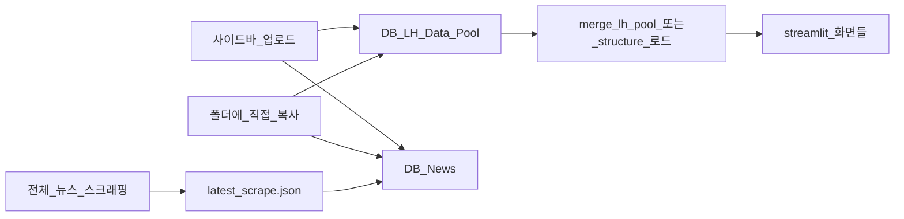

# 데이터 유입 플로우 (DB · L&H 풀 · 뉴스)

파일명 `claude-download-flow.md`는 과거 다른 프로젝트에서 이어받은 것입니다. **현재 내용은 “공시 PDF 다운로드”가 아니라 이 Streamlit 앱의 로컬 데이터 유입**을 설명합니다.

## 목표

분석·스크래핑 결과가 **`DB/L&H Data Pool`** 과 **`DB/News`** 아래에 일관되게 쌓이도록 하고, `streamlit_app.py` 사이드바·각 화면이 같은 규칙으로 읽도록 합니다.

## 1) 디렉터리 자동 생성

`src/db/db_store.py`의 `db_dir(root)`가 프로젝트 루트에 다음을 보장합니다.

- `DB/L&H Data Pool` — 실적(CSV/XLSX/XLS, 재귀 스캔)
- `DB/News` — 뉴스·이슈용 표 파일 및 스크래핑 JSON

상수: `SUBDIR_LH`, `SUBDIR_NEWS`, 실적 엑셀 헤더 행 `LH_EXCEL_HEADER_ROW = 8` (pandas `header=8`, 즉 스프레드시트 기준 9행).

## 2) 사이드바 업로드

- `save_upload_to_db(root, filename, data, pool=DbPool.LH | DbPool.NEWS)`  
  동일 파일명이 있으면 타임스탬프 접미사로 회피 저장.

## 3) L&H 실적 풀 구조

### 전체 병합(폴더 구조 무관)

- `list_lh_files(root)` — `DB/L&H Data Pool` 이하 모든 `*.csv`, `*.xlsx`, `*.xls`
- `merge_lh_pool(root)` — 위 파일을 `merge_tabular_files(..., lh_header=True)`로 병합

### 표준 3단 경로(보험사 / 보험사_P|B / 파일)

- 예: `{보험사코드}/{보험사코드}_B/{보험사코드}_B_202401.xlsx`
- `lh_pool_tree_for_display` — 사이드바 트리·월별 O/X 그리드
- `load_lh_from_structure(root, insurer_codes, ym_start, ym_end, kinds=("P","B"))` — 구조 맞는 xlsx만 기간별로 읽기
- `structured_lh_xlsx_path` — 기대 경로 생성

표준 밖 파일은 `loose` 목록으로 모아 표시됩니다.

### 실적 대시보드(기본 모드) 고정 파일

UI 도움말 기준: **`DB/L&H Data Pool/DASHBOARD/TOTAL_202406_202603.xlsx`** (가능하면 Parquet 캐시 우선). 코드·파일명이 바뀌면 `streamlit_app.py`의 해당 문자열과 이 문서를 함께 수정합니다.

## 4) 뉴스 스크래핑

- `src/scraping/insurance_scraper.py` — `run_scrape(project_root)` → **`DB/News/latest_scrape.json`**
- `load_latest_scrape`, `load_sorted_scrape_articles` — 목록·LLM 컨텍스트
- `src/scraping/news_feedback_ui.py` — 기사별 피드백(관련도 학습)
- `src/scraping/news_jobs.py` — 이슈 키워드 등 News DB 보조 경로

## 5) 흐름 요약

## 운영 시 체크

- 실적 엑셀이 깨지면 9행 헤더 규칙·시트 구조를 먼저 확인한다.
- `main_view`에서 “보험사·특약 비우면 전체” 같은 UI 문구는 필터 미적용 의미와 일치하는지 코드와 함께 본다.
