# Long-Term AI Agent 개요

## 목적

루트 `streamlit_app.py` 단일 앱에서 **정량 분석**(손해율·실적 대시보드), **정합성**(클레임·보험료), **뉴스/이슈**, **보고서·메일 초안**을 전환하며 사용합니다. 백엔드 로직은 `src/`와 `claim/`에 모듈화되어 있고, UI는 Streamlit 세션 상태로 연결됩니다.

## 핵심 용어

| 용어 | 설명 |
|------|------|
| `main_view` | `st.session_state.main_view`. 값: `dash` · `perf_dash` · `outlier` · `premium` · `issue` · `report`. |
| `ctx` | `st.session_state.ctx`. 화면별 분석 결과(dict). 예: `dashboard`, `outlier`, `premium`, `premium_inforce_ts`, `premium_forecast`, `rule_base`, `issue`, `issue_impact`. |
| `lh_snapshot` | 분석에 사용한 발생년월 구간·원수사·특약 목록. 이후 `load_lh_from_structure` 또는 `merge_lh_pool`와 범위를 맞출 때 사용. |
| `ROOT` | `streamlit_app.py` 기준 프로젝트 루트(`Path(__file__).resolve().parent`). `DB/` 경로의 기준. |

## 레이아웃 (UI)

- **사이드바**: `DB/L&H Data Pool` · `DB/News` 업로드·목록, L&H 풀 트리/월 그리드, 에이전트 플로우 다이어그램(`render_flow_diagram`), LLM 제공자·모델·키.
- **메인(좌)**: 3열×2버튼으로 `main_view` 선택 후 해당 화면 폼·결과.
- **메인(우)**: LLM Chatbot — `ctx` 요약 + 최근 대화, 스트리밍 응답.

## 화면 ↔ 모듈 매핑

```mermaid
flowchart TB
  subgraph ui [streamlit_app]
    mainView[main_view]
    sidebar[sidebar_DB_LLM]
    chatCol[LLM_Chatbot]
  end
  subgraph cat1 [정량_1열]
    dash[dash_손해율영향]
    perf[perf_dash_실적]
  end
  subgraph cat2 [정합성_2열]
    out[outlier_클레임]
    prem[premium_보험료]
  end
  subgraph cat3 [편의_3열]
    iss[issue_뉴스이슈]
    rep[report_보고서메일]
  end
  mainView --> cat1
  mainView --> cat2
  mainView --> cat3
  dash --> impact[impact_bridge]
  dash --> dq[dashboard_query]
  perf --> pdp[perf_dashboard_pivot]
  perf --> dq
  out --> cob[claim_outlier_bridge]
  out --> crules[claim_rule_ceding_contract]
  out --> obr[outlier_bridge]
  out --> claimrep[claim.reporting]
  prem --> pag[premium_aggregate_detail]
  prem --> pglm[premium_inforce_ts_glm]
  prem --> pfc[premium_forecast_models]
  prem --> newbiz[premium_newbiz_product]
  prem --> prb[premium_rule_base]
  iss --> scrap[insurance_scraper]
  iss --> nj[news_jobs]
  iss --> nfb[news_feedback_ui]
  rep --> compact[compact_ctx_for_report]
  chatCol --> llm[llm_chat]
  sidebar --> dbstore[db_store]
```



UI 모듈은 화면별로 `src/ui/views/<name>.py`에 분리되어 있고(2026-04-27 분리), 각 view의 `render(...)`가 다음 백엔드 모듈을 호출합니다.

- **1-1 `dash` / 1-2 `perf_dash`** ([`src/ui/views/dash.py`](../src/ui/views/dash.py)): `src/analysis/impact_bridge.py`, `src/db/dashboard_query.py`, 사이드바 `src/ui/agent_flow.py` (`render_flow_diagram`). `perf_dash` 서브모드 **기본** — `DB/L&H Data Pool/DASHBOARD/TOTAL_202406_202603.xlsx`(Parquet 캐시 우선). **세부** — 월별 P/B 풀(`src/db/lh_parquet_duck.py` 등). 피벗 UI: `src/ui/perf_dashboard_pivot.py`.
- **2-1 `outlier`** ([`src/ui/views/outlier.py`](../src/ui/views/outlier.py)): `src/analysis/claim_outlier_bridge.py`, `src/analysis/outlier_bridge.py`, `src/analysis/claim_rule_ceding_rate.py`, `src/analysis/claim_rule_contract_ym.py`, `claim/reporting.py`.
- **2-2 `premium`** ([`src/ui/views/premium.py`](../src/ui/views/premium.py)): `src/analysis/premium_aggregate.py`, `premium_detail.py`, `premium_inforce_ts_glm.py`, `premium_lightgbm_forecast.py`, `premium_lstm_forecast.py`, `premium_nbeats_forecast.py`, `premium_newbiz_product.py`, `src/ui/premium_rule_base.py`.
- **3-1 `issue`** ([`src/ui/views/issue.py`](../src/ui/views/issue.py)): `src/scraping/insurance_scraper.py`, `news_jobs.py`, `news_feedback_ui.py`, `news_prompts.py`, 영향도 `impact_bridge.py`.
- **3-2 `report`** ([`src/ui/views/report.py`](../src/ui/views/report.py)): `ctx`에서 선택 키만 뽑아 LLM에 JSON으로 전달(스트리밍).
- **사이드바**(`src/ui/sidebar.py`) — DB 업로드·풀 트리·LLM Provider 설정. `st.session_state["llm_cfg"]`에 결과 저장.
- **챗봇**(`src/ui/chatbot.py`) — 우측 LLM Chatbot 컬럼. `llm_cfg` + `ctx`를 읽어 응답.
- **공용**(`src/ui/_shared.py`) — 상수(`PREMIUM_FC_MODELS`, `OLLAMA_MODEL_OPTIONS` 등), LLM·LH·fingerprint·보고서 컨텍스트 헬퍼.

원수사·특약 옵션: `src/config/insurers.py`.

<h2 id="folder-layout-convention">최상위 폴더 규약 (목표)</h2>

루트에 실험·레거시 폴더가 늘어나면 **담당 경계가 흐려지고**, 동일 파일을 건드리며 충돌하기 쉽습니다. 아래는 **장기적으로 유지하고 싶은 최상위 덩어리**입니다. 당장 전체를 옮기지 않아도 되고, **신규 코드·정리·리팩터 시 이 규약을 우선**합니다.

### 규약상 큰 구역

| 구역 | 역할 | 앱에서 대응하는 축 |
|------|------|-------------------|
| **데이터** | 실적·뉴스 등 입력·산출물. 코드가 참조하는 런타임 데이터 루트. | `DB/L&H Data Pool`, `DB/News` 등 ([claude-download-flow.md](claude-download-flow.md)) |
| **기능1 (대시보드·정량)** | 손해율·실적 조회, 피벗, 영향도 요약 UI. | `main_view`: **`dash`**, **`perf_dash`** |
| **기능2 (검증·정합성)** | 보험료·클레임 쪽 규칙·모델·표시. | 아래 하위로 구분 |
| **기능2.1 (보험료 검증)** | 집계·상세·유지 GLM·예측·신계약·룰베이스 UI. | `main_view`: **`premium`** |
| **기능2.2 (클레임 이상치)** | GLM/이상치 브리지, 출재율·계약년월 룰, TOP 클레임 표. | `main_view`: **`outlier`** (`claim/reporting.py` 등) |
| **기능3 (뉴스·이슈)** | 스크래핑, 피드백, 이슈 키워드·News DB, (연계) 영향도 스텁. | `main_view`: **`issue`** (`src/scraping/*`) |
| **편의 · 보고·LLM** | 보고서/메일 초안, 사이드바·챗봇 공통 LLM. | `main_view`: **`report`** · `src/llm/chat.py` (여러 화면에서 공유) |
| **docs** | 본 문서 세트·인덱스. | `docs/`, 루트 `CLAUDE.md` |
| **archive** | 과거 분석·실험용으로 만들었으나 **현재 Streamlit 메인 경로에서 쓰지 않는** 코드·노트북·부분 프로젝트. | 예: `outdated/` 이하, 중복 미러 폴더 정리 시 이쪽으로 옮기거나 README만 남기기 |

### 물리 경로 이름 (제안)

한글 구역명을 그대로 쓰거나, 리팩터 시 아래처럼 나눌 수 있습니다. **이름은 팀 합의로 확정**하면 되고, 문서는 “역할”을 기준으로 한다.

- 데이터: 지금은 코드가 **`DB/`** 를 전제로 함(`db_store.py`). `data/` 등으로 바꿀 때는 경로 상수·문서를 한 번에 맞출 것.
- 기능1~3: 현재는 대부분 **`src/analysis/`**, **`src/db/`**, **`src/ui/`**, **`src/scraping/`**, **`claim/`** 에 섞여 있음. 정리 시 예: `src/features/dashboard/`, `src/features/validation/premium/`, `src/features/validation/claims/`, `src/features/news/` (가칭).

### 현재 저장소와의 관계 (솔직한 한 줄)

**규약 = 목표 지도**, **현재 = `src/` 중심의 단일 패키지 + 루트에 별도 실험 폴더가 많음**이다. 새 폴더를 루트에 추가할 때는 위 표의 어느 구역에 속하는지 먼저 정하고, 장기적으로는 **archive·docs·데이터·기능**만 남도록 줄이는 것을 권장한다.

## 디렉터리 레이아웃 (현재 상태)

2026-04-27 폴더 정리 후 실제 구조:

```
프로젝트루트/
  streamlit_app.py      # 메인 UI 진입점
  requirements.txt
  CLAUDE.md
  .gitignore            # API/, .env, __pycache__, AIzaSy* 등 제외
  .env.example          # 환경변수 템플릿 (.env는 로컬에만)
  docs/                 # 본 문서 세트
  src/
    analysis/           # 수치·통계·예측 브리지
    config/             # insurers 등
    db/                 # db_store, dashboard_query, lh_parquet_duck, lh_warehouse …
    llm/                # chat.py (Ollama/OpenAI/Gemini)
    scraping/           # 뉴스 스크래핑·피드백 UI (메인)
    ui/                 # 피벗, 룰베이스, agent_flow
    graph/, schemas/, data/
  claim/
    reporting.py        # 클레임 표시용 (TOP_CLAIM 등)
  DB/                   # 런타임 데이터 (git에 없을 수 있음)
    L&H Data Pool/
    News/
  archive/              # 레거시·미통합 자료 (README.md 참고)
    legacy_agent_app/         # 구 Streamlit 앱 (Agent/)
    legacy_premium_notebooks/ # premium/ 노트북·엑셀
    legacy_coverage_mapping/  # 미통합 담보 매핑
    legacy_location_geolocation/  # 별도 지오코딩 프로젝트
    old_scrapping/            # 구 스크래핑 (src/scraping 사용)
    patch_scripts/            # 일회성 패치 스크립트 (tools/ + _patch_glm_cov.py)
    gradio_app.py             # Gradio 초기 앱 (대체됨)
    agent_definition.py       # 미사용 정의
    run_agent.py              # 구 Agent 실행 스크립트
  내부 보고/             # 보고서 .docx (출력물)
  *.bat                  # Windows 개발 편의 스크립트
```

기준 코드 경로는 루트 **`src/`** 와 **`claim/`** 입니다. 새 코드는 [최상위 폴더 규약](#folder-layout-convention)에 따라 위치를 정합니다.

<h2 id="single-file-ui-collab">엔트리 UI와 협업</h2>

루트 [`streamlit_app.py`](../streamlit_app.py)는 **thin entry**(약 470줄)로, CSS·세션 기본값·상단 6버튼 라우터만 갖습니다. 화면별 본문은 `src/ui/views/*.py`로 분리되어 있어 **담당자별 병렬 작업과 PR 분리가 가능**합니다.

### 모듈 매핑

| 화면(`main_view`) | 모듈 | render 시그니처 |
| --- | --- | --- |
| 사이드바 (DB·LLM Provider) | [`src/ui/sidebar.py`](../src/ui/sidebar.py) | `render_sidebar(root)` — `st.session_state["llm_cfg"]` 채움 |
| 우측 LLM Chatbot | [`src/ui/chatbot.py`](../src/ui/chatbot.py) | `render_chatbot()` — `llm_cfg` 읽음 |
| `dash` / `perf_dash` | [`src/ui/views/dash.py`](../src/ui/views/dash.py) | `render(root, mv)` |
| `outlier` | [`src/ui/views/outlier.py`](../src/ui/views/outlier.py) | `render(root, conversation_for_llm)` |
| `premium` | [`src/ui/views/premium.py`](../src/ui/views/premium.py) | `render(root, conversation_for_llm)` |
| `issue` | [`src/ui/views/issue.py`](../src/ui/views/issue.py) | `render(root, conversation_for_llm)` |
| `report` | [`src/ui/views/report.py`](../src/ui/views/report.py) | `render(conversation_for_llm)` |
| 공용 상수·헬퍼 | [`src/ui/_shared.py`](../src/ui/_shared.py) | constants & funcs |

### 세션 계약

- **`st.session_state["llm_cfg"]`** — 사이드바가 채우는 dict(`provider`, `model`, `api_key`, `ollama_*`). view·chatbot의 LLM 호출은 모두 여기서 읽습니다. **위젯 키(`llm_provider` 등)에 직접 접근하지 마세요.**
- **`st.session_state.ctx`** — 화면별 분석 결과(`outlier`, `premium`, `dashboard`, `issue` 등). 보고서 화면이 이 dict를 묶어 LLM에 전달합니다.
- **`st.session_state.lh_snapshot`** — 마지막 분석에서 사용한 기간·원수사·특약 범위.

### 작업 시 가이드

- 새 화면 추가: `src/ui/views/<name>.py` + `streamlit_app.py` 라우터에 `elif mv == "<name>"` 분기 추가.
- 공용 헬퍼는 `src/ui/_shared.py`로 끌어올립니다(여러 view에서 쓸 때만).
- 큰 구조 변경은 [claude-changelog.md](claude-changelog.md)에 기록합니다.

## 의존성 참고

`requirements.txt`에 LangChain·LangGraph 등이 포함되어 있으나, **`streamlit_app.py`는 `src/graph/`를 직접 import하지 않습니다.** UI 진입은 Streamlit 단일 파일이며, 그래프 라이브러리는 다른 스크립트나 향후 확장용으로 둔 것으로 보면 됩니다.

## 문서화 원칙

- 화면·`ctx` 키·`DB` 경로를 바꾸면 본 개요와 [claude-json-build.md](claude-json-build.md)를 함께 갱신한다.
- 데이터 파일 규칙(엑셀 9행 헤더 등)은 `src/db/db_store.py`의 상수·docstring을 기준으로 한다.
