# CLAUDE / docs — Streamlit 앱 기준 문서 정렬

## 현재 불일치 요약

| 항목 | 기존 문서 | 실제 프로젝트(루트) |
|------|-----------|---------------------|
| 목적 | `kics_data.json` 파이프라인 | [streamlit_app.py](c:\Users\sangwook.cho\OneDrive - 코리안리재보험\머신러닝\streamlit_app.py) — Long-Term AI Agent UI |
| 데이터 | 공시 PDF, `md_inbox`, 스키마 | [DB/L&H Data Pool](c:\Users\sangwook.cho\OneDrive - 코리안리재보험\머신러닝\src\db\db_store.py), `DB/News`, XLSX/CSV/Parquet |
| 진입점 | `scripts/run_harness.py` | `streamlit run streamlit_app.py` (하네스 스크립트는 **루트에 없음**) |
| 코드 레이아웃 | `src/solvency/...` | `src/analysis`, `src/db`, `src/ui`, `src/scraping`, `src/llm`, `src/config` + [claim/reporting.py](c:\Users\sangwook.cho\OneDrive - 코리안리재보험\머신러닝\claim\reporting.py) |

레거시 솔벤시 자료는 [outdated/solvency](c:\Users\sangwook.cho\OneDrive - 코리안리재보험\머신러닝\outdated\solvency) 등에 남아 있을 수 있으나, **문서의 기준 축은 루트 Streamlit 앱**으로 둡니다.

---

## `streamlit_app.py`가 구성하는 화면·프로세스 (문서에 반영할 사실관계)

### 레이아웃

- **사이드바**: `DB` 파일 업로드·목록([`src/db/db_store.py`](c:\Users\sangwook.cho\OneDrive - 코리안리재보험\머신러닝\src\db\db_store.py)), L&H 풀 트리/월별 그리드, **LLM 제공자**(Ollama / OpenAI / Gemini) 및 모델·키([`src/llm/chat.py`](c:\Users\sangwook.cho\OneDrive - 코리안리재보험\머신러닝\src\llm\chat.py)).
- **메인**: `st.session_state.main_view`로 6화면 전환 — `dash` | `perf_dash` | `outlier` | `premium` | `issue` | `report`.
- **우측 열**: `LLM Chatbot` — `ctx` 요약([`_compact_ctx_for_report`](c:\Users\sangwook.cho\OneDrive - 코리안리재보험\머신러닝\streamlit_app.py), [`_agent_chat_context_blob`](c:\Users\sangwook.cho\OneDrive - 코리안리재보험\머신러닝\streamlit_app.py)) + `chat_messages`, `_run_agent_chat_reply`.

### `ctx` / 스냅샷 (분석 상태)

- `st.session_state.ctx`: `dashboard`, `outlier`, `premium`, `premium_inforce_ts`, `premium_forecast`, `rule_base`, `issue`, `issue_impact` 등 화면별 결과 저장.
- `lh_snapshot`: 발생년월·원수사·특약 범위를 이후 로드([`load_lh_from_structure`](c:\Users\sangwook.cho\OneDrive - 코리안리재보험\머신러닝\src\db\db_store.py), [`merge_lh_pool`](c:\Users\sangwook.cho\OneDrive - 코리안리재보험\머신러닝\src\db\db_store.py))와 맞추는 용도.

### 화면별 주요 모듈 매핑

```mermaid
flowchart TB
  subgraph ui [streamlit_app.py]
    mainView[main_view_switch]
    sidebar[sidebar_DB_LLM]
    chatCol[LLM_Chatbot]
  end
  subgraph cat1 [1_정량]
    dash[dash_손해율영향]
    perf[perf_dash_실적]
  end
  subgraph cat2 [2_정합성]
    out[outlier_클레임]
    prem[premium_보험료]
  end
  subgraph cat3 [3_편의]
    iss[issue_뉴스이슈]
    rep[report_보고서메일]
  end
  mainView --> cat1
  mainView --> cat2
  mainView --> cat3
  dash --> impact[impact_bridge]
  dash --> dq[dashboard_query]
  perf --> pdp[perf_dashboard_pivot]
  perf --> dq
  out --> cob[claim_outlier_bridge]
  out --> crules[claim_rule_ceding_rate_contract_ym]
  out --> claimrep[claim.reporting]
  prem --> pag[premium_aggregate_detail]
  prem --> pglm[premium_inforce_ts_glm]
  prem --> pfc[premium_lightgbm_lstm_nbeats]
  prem --> newbiz[premium_newbiz_product]
  prem --> prb[premium_rule_base_ui]
  iss --> scrap[insurance_scraper_news_jobs]
  iss --> nfb[news_feedback_ui]
  rep --> compact[_compact_ctx_for_report]
  chatCol --> llm[llm_chat_stream]
  sidebar --> dbstore[db_store]
```

- **1-1 dash**: [`impact_bridge`](c:\Users\sangwook.cho\OneDrive - 코리안리재보험\머신러닝\src\analysis\impact_bridge.py), [`dashboard_query`](c:\Users\sangwook.cho\OneDrive - 코리안리재보험\머신러닝\src\db\dashboard_query.py), [`render_flow_diagram`](c:\Users\sangwook.cho\OneDrive - 코리안리재보험\머신러닝\src\ui\agent_flow.py)(사용 여부는 해당 분기 내 확인 유지).
- **1-2 perf_dash**: 기본/세부 서브모드 — TOTAL XLSX·Parquet·DuckDB 경로는 UI 캡션과 [`dashboard_query`](c:\Users\sangwook.cho\OneDrive - 코리안리재보험\머신러닝\src\db\dashboard_query.py), [`perf_dashboard_pivot`](c:\Users\sangwook.cho\OneDrive - 코리안리재보험\머신러닝\src\ui\perf_dashboard_pivot.py), [`lh_parquet_duck`](c:\Users\sangwook.cho\OneDrive - 코리안리재보험\머신러닝\src\db\lh_parquet_duck.py)에 정리.
- **2-1 outlier**: [`claim_outlier_bridge`](c:\Users\sangwook.cho\OneDrive - 코리안리재보험\머신러닝\src\analysis\claim_outlier_bridge.py), [`outlier_bridge`](c:\Users\sangwook.cho\OneDrive - 코리안리재보험\머신러닝\src\analysis\outlier_bridge.py), 클레임 룰, [`claim/reporting`](c:\Users\sangwook.cho\OneDrive - 코리안리재보험\머신러닝\claim\reporting.py).
- **2-2 premium**: 집계·상세·유지 GLM·예측(N-BEATS/LSTM/LightGBM)·신계약, [`premium_rule_base`](c:\Users\sangwook.cho\OneDrive - 코리안리재보험\머신러닝\src\ui\premium_rule_base.py).
- **3-1 issue**: [`insurance_scraper`](c:\Users\sangwook.cho\OneDrive - 코리안리재보험\머신러닝\src\scraping\insurance_scraper.py), [`news_jobs`](c:\Users\sangwook.cho\OneDrive - 코리안리재보험\머신러닝\src\scraping\news_jobs.py), [`news_feedback_ui`](c:\Users\sangwook.cho\OneDrive - 코리안리재보험\머신러닝\src\scraping\news_feedback_ui.py), 영향도 [`impact_bridge`](c:\Users\sangwook.cho\OneDrive - 코리안리재보험\머신러닝\src\analysis\impact_bridge.py).
- **3-2 report**: `ctx` 서브집합 + LLM 스트리밍으로 보고서·메일 초안.

원수사·특약 옵션: [`src/config/insurers.py`](c:\Users\sangwook.cho\OneDrive - 코리안리재보험\머신러닝\src\config\insurers.py).

참고: [`requirements.txt`](c:\Users\sangwook.cho\OneDrive - 코리안리재보험\머신러닝\requirements.txt)에 LangGraph 등이 있으나 **`streamlit_app.py`는 graph 모듈을 직접 import하지 않음** — 개요에 “의존성에 포함, UI 진입은 Streamlit 단일 파일” 정도로만 명시.

---

## 파일별 수정 방향

### [CLAUDE.md](c:\Users\sangwook.cho\OneDrive - 코리안리재보험\머신러닝\CLAUDE.md)

- 제목·소개를 **Long-Term AI Agent (Streamlit)** 인덱스로 교체.
- “새 세션은 changelog 먼저” 관행은 유지.
- 문서 링크 목록을 아래 재구성된 `docs/*` 제목에 맞게 수정.
- “빠른 결론”을 **실행 방법·DB 위치·main_view·LLM** 중심 bullet로 교체.
- KICS PDF 운영 상태 단락 **삭제** 또는 “별도 레거시 폴더” 한 줄로만.

### [docs/claude-overview.md](c:\Users\sangwook.cho\OneDrive - 코리안리재보험\머신러닝\docs\claude-overview.md)

- 목적: 앱 아키텍처·용어(`ctx`, `lh_snapshot`, `main_view`)·디렉터리 레이아웃(루트 `streamlit_app.py`, `src/`, `DB/`, `claim/`).
- mermaid: 위 “화면별 모듈” 수준의 흐름도로 교체 (PDF/Docling 제거).

### [docs/claude-download-flow.md](c:\Users\sangwook.cho\OneDrive - 코리안리재보험\머신러닝\docs\claude-download-flow.md)

- 파일명은 유지하되 **내용을 “데이터 유입 플로우”**로 교체: 사이드바 업로드 → `save_upload_to_db`, L&H 풀 폴더 규칙(`lh_pool_tree_for_display`, P/B 하위 구조), 선택적 Parquet/DuckDB, 뉴스 스크래핑 → `DB/News/latest_scrape.json` 등.

### [docs/claude-gemini-flow.md](c:\Users\sangwook.cho\OneDrive - 코리안리재보험\머신러닝\docs\claude-gemini-flow.md)

- **LLM 운영 모델**로 교체: [`chat.py`](c:\Users\sangwook.cho\OneDrive - 코리안리재보험\머신러닝\src\llm\chat.py)의 LangChain 기반 Ollama/OpenAI/Gemini, `llm_stream`/`llm_complete`, 사이드바 설정과의 연결, Ollama 출력 정제(`_sanitize_ollama_output_text`) 등. (제목이 Gemini-only가 아니므로 문서 상단에 “파일명 레거시” 또는 overview 링크로 명확화.)

### [docs/claude-json-build.md](c:\Users\sangwook.cho\OneDrive - 코리안리재보험\머신러닝\docs\claude-json-build.md)

- **Markdown→kics JSON 제거**. 대신 **“분석 컨텍스트 빌드”**: 각 화면이 `ctx`에 무엇을 쓰는지, 보고서/챗봇이 [`_compact_ctx_for_report`](c:\Users\sangwook.cho\OneDrive - 코리안리재보험\머신러닝\streamlit_app.py)로 어떻게 줄이는지 표·bullet로 정리.

### [docs/claude-validation-harness.md](c:\Users\sangwook.cho\OneDrive - 코리안리재보험\머신러닝\docs\claude-validation-harness.md)

- **성격이 다른 부분**(KICS `run_harness.py`, `schemas/kics_data.schema.json`, golden MD 등)은 삭제하거나 “이 루트 저장소에는 없음”으로 명시.
- **유지·일반화**: ruff/black/mypy, 단위 테스트 권장 구조, Streamlit 수동 스모크(주요 `main_view` 클릭·업로드), 선택적 `pytest` 도입 시 `src/analysis`·`src/db` 순수 함수 위주.
- 사용자 의견대로 **기본 문법·구조 검사 철학**은 짧게 유지.

### [docs/claude-changelog.md](c:\Users\sangwook.cho\OneDrive - 코리안리재보험\머신러닝\docs\claude-changelog.md)

- KICS 장문 이력은 혼란을 줄이므로 **맨 위에 2026-04-27(또는 작업일) 항목**: “문서를 Streamlit 앱 기준으로 재작성, KICS 전용 이력은 아래 보관용으로 축약 또는 삭제” 정책을 명시.
- 이전 KICS 항목: **삭제** vs **하단 “보관(레거시)” 블록으로 이동** — 구현 시 사용자 선호에 맞춰 하나만 선택 (기본안: **삭제하고** 짧은 한 줄로 “과거 문서는 KICS 타 프로젝트 기준이었음”만 남김).

---

## 구현 시 주의

- 문서에 적는 **파일 경로·상수**(예: `LH_EXCEL_HEADER_ROW`, `SUBDIR_LH`)는 실제 코드와 맞추기 위해 필요 시 해당 파일 한 번 더 대조.
- [AI_Agent_JW/](c:\Users\sangwook.cho\OneDrive - 코리안리재보험\머신러닝\AI_Agent_JW) 등 중복 트리는 **문서 기준 경로에서 제외**하거나 “미러/실험용” 한 줄로만 언급.

## 완료 기준

- 새 세션이 `CLAUDE.md`만 봐도 **실행 명령·DB 구조·화면 6종·주요 `src` 모듈**을 찾을 수 있음.
- KICS·`kics_data.json`·`run_harness`가 **본문 기준 사실**로 남아 있지 않음(레거시 언급은 선택적 한 줄).
- 검증 문서는 **허구 경로 없이** 일반 품질 가이드 + 이 프로젝트 현실(자동 하네스 없음)이 일치.
